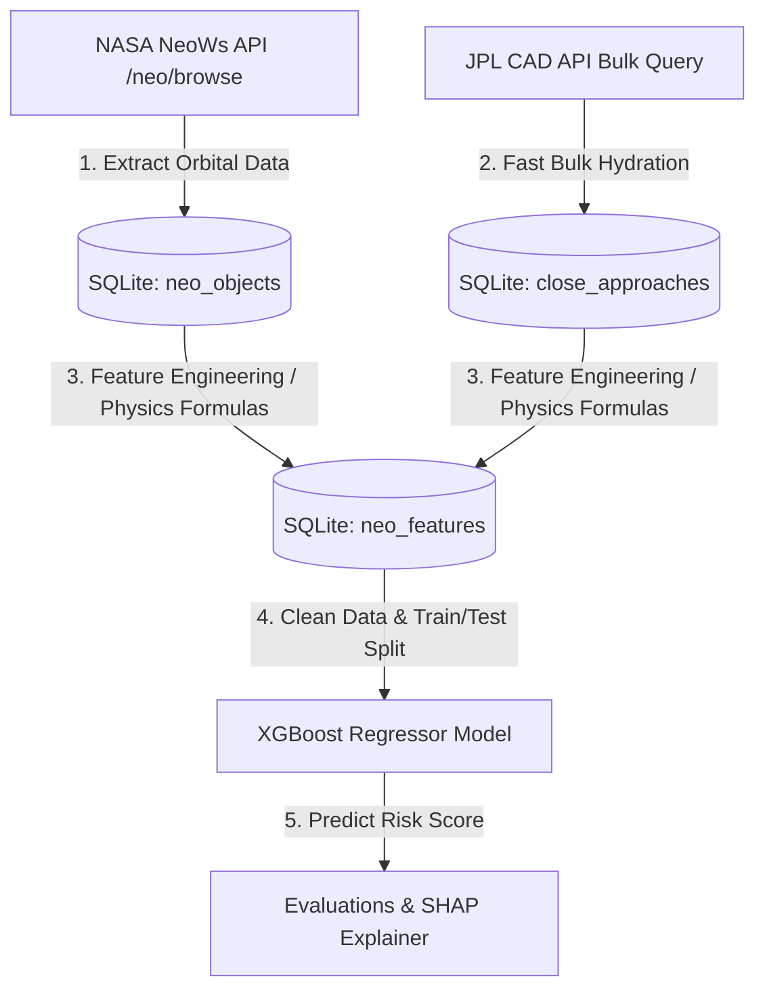
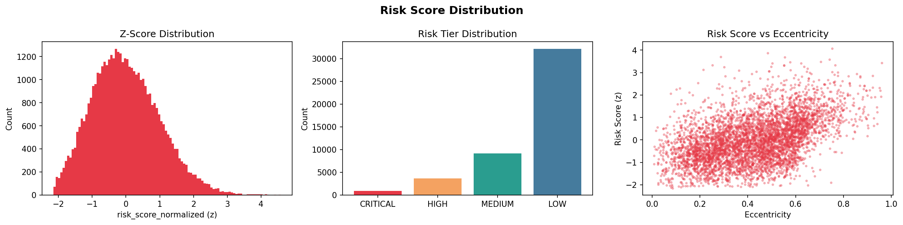
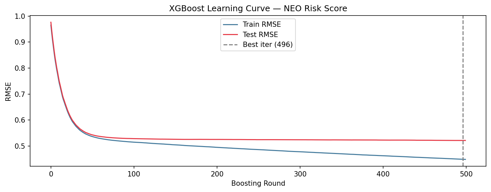
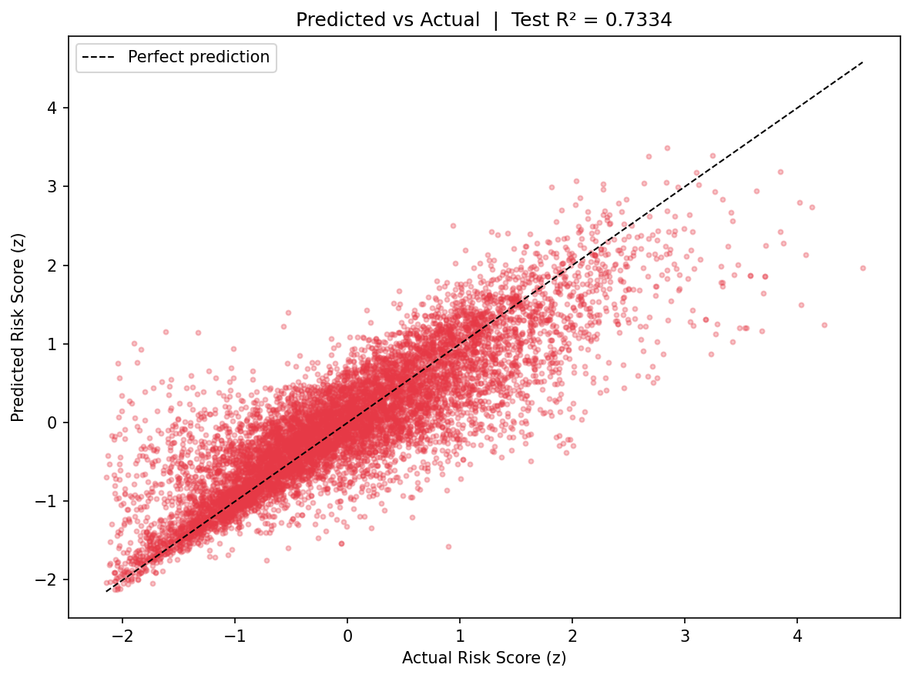
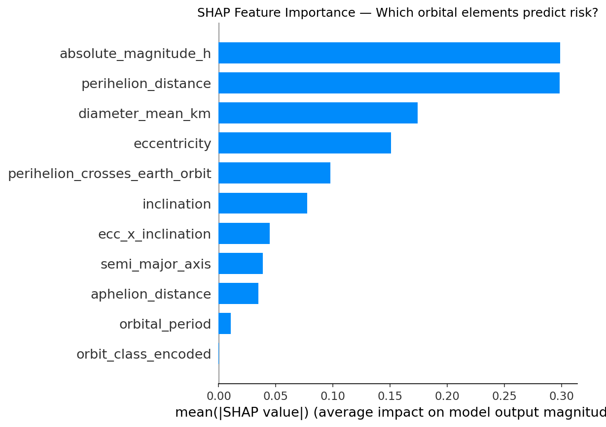
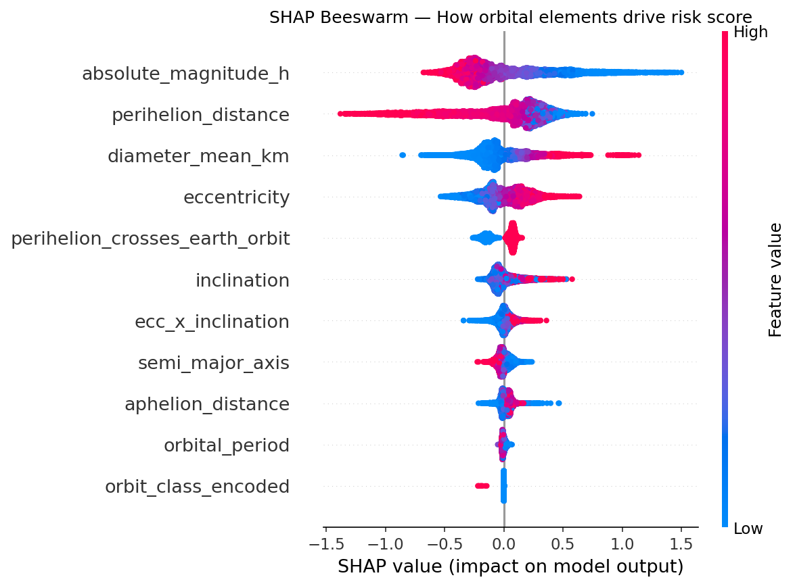

# Monarch Industries | Near Earth Object (NEO) Risk Scorer

An end-to-end Machine Learning pipeline utilizing XGBoost to predict asteroid threat index metrics directly from static, geometric orbital path elements, leveraging real-time NASA NeoWs and JPL database APIs.

---

## 1. Executive Summary & The Problem

Earth is constantly in the path of debris, meteoroids, and asteroids. Historically, space agencies like NASA have classified asteroids as **Potentially Hazardous Asteroids (PHAs)** using a binary classification system based on:
1. **Size**: Absolute magnitude $H \le 22.0$ (roughly $\ge 140\text{ meters}$).
2. **Proximity**: Minimum Orbit Intersection Distance (MOID) to Earth of $\le 0.05\text{ AU}$ (roughly $7.5\text{ million km}$).

### The Limitation of Binary Classifications
This binary label is too coarse. An asteroid that just misses the threshold is treated as "completely safe," while one that crosses the threshold is labeled "potentially hazardous," regardless of whether its close-approach velocity is low or if it only approaches once every few centuries. Furthermore, running century-long N-body numerical integration simulations to calculate exact close approaches is computationally expensive and slow.

### The Solution
This project solves this by constructing a continuous, physically grounded **NEO Risk Score** (the target variable $y$) which accounts for:
* The **kinetic energy** of the object (mass and velocity).
* The **closeness** of the approaches (miss distance).
* The **frequency** of dangerous encounters (chronic risk vs. peak risk).

Once constructed, we train an **XGBoost Regressor** to predict this normalized risk score ($y$) using **only static orbital parameters** ($X$) that can be observed instantly when an asteroid is first discovered. This bypasses the need for intensive gravitational simulation runs, allowing astronomers to immediately flag high-risk objects from a single night of tracking.

---

## 2. System Architecture & Pipeline



### Step 1: Data Scraping & Bulk Hydration
1. **Browse Phase (`scraper.py`)**: Fetches core asteroid names and static orbital elements from NASA's NeoWs API `/neo/browse`. It saves these to the `neo_objects` table.
2. **Hydration Phase (`hydrate_bulk.py`)**: To build the risk score, we need the entire history of Earth close approaches for each asteroid. Standard NeoWs query `/neo/{id}` requires one API request per asteroid (for $\sim 62,000$ asteroids, this would take $\sim 2\text{ days}$). 
   * **JPL CAD Bulk Hydration**: We query the **JPL Close Approach Data (CAD) API** (`ssd-api.jpl.nasa.gov/cad.api`) in bulk. The script chunk-requests close approach records between the years 1900 and 2200 for objects coming within $0.2\text{ AU}$ of Earth.
   * Matches JPL CAD records to SQLite records using designation and name string-matching, saving $\sim 860,000$ close approach records in minutes.

### Step 2: Feature Engineering & Risk Scoring Math
The script `features.py` compiles orbital elements into the feature matrix ($X$) and constructs the target variable ($y$) using the following physics-based formulations:

#### A. Kinetic Energy Proxy ($KE_{\text{proxy}}$)
Asteroid mass $m$ scales cubically with mean diameter ($m \propto D^3$). However, due to large observational uncertainties in density and albedo, we use a squared diameter proxy to avoid over-penalizing measurement noise:
$$KE_{\text{proxy}} = D^2 \cdot v^2$$
Where:
* $D$ = Mean estimated diameter of the asteroid ($\text{km}$).
* $v$ = Relative close-approach velocity ($\text{km/s}$).

#### B. Per-Approach Risk ($R_{\text{approach}}$)
The danger of a single close-approach event scales inversely with the square of the miss distance, softened by a small $\epsilon$ to prevent division-by-zero on collision paths:
$$R_{\text{approach}} = \frac{KE_{\text{proxy}}}{d^2 + \epsilon}$$
Where:
* $d$ = Miss distance in Astronomical Units ($\text{AU}$).
* $\epsilon = 10^{-6}\text{ AU}^2$ (Epsilon softening parameter).

#### C. Object-Level Raw Risk Score ($\text{Risk}_{\text{raw}}$)
To capture both a singular devastating impact threat (peak risk) and a pattern of repeated close encounters (chronic risk), we aggregate all close-approach events for a given asteroid:
$$\text{Risk}_{\text{raw}} = \max(R_{\text{approach}}) + w_{\text{chronic}} \cdot \text{mean}(R_{\text{approach}})$$
Where the chronic weight $w_{\text{chronic}} = 0.3$.

#### D. Two-Stage Target Normalization
Because raw risk scores span many orders of magnitude and are highly right-skewed, we normalize them to help the regression model converge:
1. **Log-Softening**: Compress the exponential tail with a log-plus-one transform:
   $$\text{Risk}_{\text{log}} = \ln(\text{Risk}_{\text{raw}} + 1)$$
2. **Standardization (Z-Score)**: Map to a standard normal distribution (zero mean, unit variance):
   $$z = \frac{\text{Risk}_{\text{log}} - \mu}{\sigma}$$
   Where $\mu$ and $\sigma$ are the mean and standard deviation of $\text{Risk}_{\text{log}}$ across the entire dataset.

#### E. Qualitative Risk Tiers
We segment asteroids into tiers using strict percentile cuts on the Z-scores:
* **CRITICAL** (Top 2%): $z \ge 1.954$
* **HIGH** (2% - 10%): $1.282 \le z < 1.954$
* **MEDIUM** (10% - 30%): $0.524 \le z < 1.282$
* **LOW** (Bottom 70%): $z < 0.524$

The target variable ($y$) is `risk_score_normalized` ($z$). The close-approach parameters ($d, v,$ and approach count) are **strictly withheld** from the model inputs ($X$) to prevent target leakage.

---

## 3. Machine Learning Model Training

The training process is detailed in the notebook [NEO_RISK_XGBOOST.ipynb](file:///c:/Users/hp/Desktop/NASA%20+%20Machine%20learning/NEO_RISK_SCORING/NEO_RISK_XGBOOST.ipynb).

### Input Features ($X$, Static Orbital Elements Only)
The model predicts risk using exactly 11 orbital elements:
1. `absolute_magnitude_h`: Size indicator ($H$, smaller means larger object).
2. `diameter_mean_km`: Estimated mean diameter in km.
3. `eccentricity`: Shape of the orbit ($e$, degree of elongation).
4. `semi_major_axis`: Average distance from the Sun in AU ($a$).
5. `inclination`: Angle of the orbit relative to Earth's orbital plane in degrees ($i$).
6. `perihelion_distance`: Point of closest approach to the Sun in AU ($q = a(1-e)$).
7. `aphelion_distance`: Point of furthest distance from the Sun in AU ($Q = a(1+e)$).
8. `orbital_period`: Time to complete one orbit in days.
9. `perihelion_crosses_earth_orbit`: Binary indicator ($1$ if $q < 1.0\text{ AU}$, $0$ otherwise).
10. `ecc_x_inclination`: Interaction feature capturing non-coplanar elongated orbits ($e \cdot i$).
11. `orbit_class_encoded`: Categorical encoding of orbital family (Apollo/Aten = 3, Amor/IEO = 2, Atira = 1, Other = 0).

### Model Configuration (XGBoost Regressor)
```python
model = XGBRegressor(
    n_estimators          = 500,
    max_depth             = 6,
    learning_rate         = 0.05,
    subsample             = 0.8,
    colsample_bytree      = 0.8,
    min_child_weight      = 3,
    reg_alpha             = 0.1,    # L1 Regularization
    reg_lambda            = 1.0,    # L2 Regularization
    objective             = 'reg:squarederror',
    eval_metric           = 'rmse',
    early_stopping_rounds = 30,
    random_state          = 42
)
```

The dataset is partitioned into an **80% training set (36,764 objects)** and a **20% test set (9,191 objects)**.

---

## 4. Model Evaluations & Interpretation

### Quantitative Performance Metrics
The model was evaluated on the unseen test set, yielding the following results:

| Metric | Value | Interpretation |
| :--- | :--- | :--- |
| **Train $R^2$** | **0.7976** | The model explains 79.76% of risk variance on training data. |
| **Test $R^2$** | **0.7334** | **Key Metric:** Over 73.3% of risk variance is predictable using static orbital elements. |
| **Test RMSE** | **0.5213** | Root Mean Squared Error of prediction is $\sim0.52$ standard deviations. |
| **Test MAE** | **0.3724** | Mean Absolute Error is $\sim0.37$ standard deviations. |
| **Generalization Gap** | **0.0642** | Gap is $< 0.10$, indicating robust regularization and no overfitting. |

### Visual Analysis

#### A. Risk Distribution Check
The baseline distributions show how Z-scores map directly to risk tiers:

* *Left Plot*: The Z-score target follows a clean standardized normal curve.
* *Center Plot*: Displays the distribution of classes, illustrating that `LOW` risk is the dominant class, while `CRITICAL` risk represents a narrow slice of the tail.
* *Right Plot*: Indicates a clear positive relationship between eccentricity and risk, showing that highly elliptical orbits are inherently more dangerous.

#### B. Convergence (Learning Curve)
The loss history across boosting rounds proves the effectiveness of the training loop:

* The test set RMSE converges stably with the training RMSE. 
* Early stopping checks halted the ensemble at round 496, stopping immediately when the test validation loss leveled out, avoiding overfitting.

#### C. Prediction Accuracy (Predicted vs. Actual)
The model's alignment with actual risk indices is plotted below:

* Predictions concentrate tightly along the perfect $y=x$ prediction line.
* The model retains predictive accuracy even at the highest extremities ($z > 3.0$), which contains the most hazardous objects.

---

## 5. SHAP (SHapley Additive exPlanations) Analysis

SHAP values are calculated to explain the model's predictions by measuring the contribution of each orbital element to the final predicted risk score.

### Global Feature Importance

* **`diameter_mean_km`** is the single most dominant predictor. This matches physical expectations: mass drives kinetic energy, representing the primary threat.
* **`absolute_magnitude_h`** and **`perihelion_distance`** are the second and third most important. An object's physical size and how close its orbit gets to the Sun (and by extension, Earth's orbit) are strong predictors of threat level.

### Directional Impact (SHAP Beeswarm Plot)
The beeswarm plot shows how high or low values of a feature shift the risk score up or down:


1. **`diameter_mean_km` (Mean Diameter)**: Red dots (high values) are pushed far to the right, meaning larger diameters strongly increase the predicted risk score.
2. **`absolute_magnitude_h` (H Magnitude)**: Blue dots (low values, corresponding to physically larger, brighter asteroids) push risk UP. Red dots (high values, small dim objects) push risk DOWN.
3. **`perihelion_distance` (Perihelion)**: Blue dots (low perihelion distance, meaning the asteroid passes close to the Sun, crossing Earth's 1.0 AU path) push risk UP. Red dots (large perihelion, staying far out) push risk DOWN.
4. **`eccentricity` (Eccentricity)**: Red dots (high eccentricity, elongated orbits) push risk UP, as these orbits are more likely to cross Earth's circular path.

---

## 6. Riskiest Predicted NEOs
Sorting the test partition predictions ($20\%$ of the clean database) reveals the highest-predicted risk objects in our catalog:

| Rank | Name | Predicted $z$ | Actual $z$ | Tier |
| :--- | :--- | :---: | :---: | :---: |
| 1 | 139359 (2001 ME1) | 3.4887 | 2.8420 | CRITICAL |
| 2 | 3752 Camillo (1985 PA) | 3.3980 | 3.2459 | CRITICAL |
| 3 | 276049 (2002 CE26) | 3.3901 | 2.6780 | CRITICAL |
| 4 | 1866 Sisyphus (1972 XA) | 3.1938 | 3.8464 | CRITICAL |
| 5 | 66008 (1998 QH2) | 3.1751 | 3.1026 | CRITICAL |

---

## 7. How to Run the Pipeline

### Prerequisites
Install all libraries listed in the requirements file:
```bash
pip install -r requirements.txt
```

### Execution Steps
1. **Initialize and Scrape Orbital Data**:
   ```bash
   python scraper.py --phase browse
   ```
2. **Bulk Hydrate Close Approaches**:
   ```bash
   python hydrate_bulk.py
   ```
3. **Perform Feature Engineering & Compute Target**:
   ```bash
   python features.py
   ```
4. **Train and Evaluate XGBoost Model**:
   Run the Colab/Jupyter Notebook `NEO_RISK_XGBOOST.ipynb` to train the model, evaluate performance, and generate SHAP plots.
